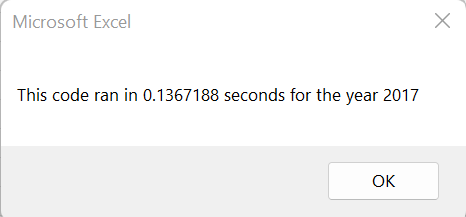

# Stock-Analysis

## Overview of Project

### Purpose

The purpose of this data analysis was to analyze stock trends and give a clear idea of which stocks would be profitable to invest in.

We also refactored the code to run faster and be able to handle more than 12 stocks.

## Results

- In 2017, all but one stock (TERP) had a positive return.

- In 2018, only 'ENPH' and 'RUN' had a positive return.
    - 'ENPH' went down from a 129.5% return to a 81.9% return
    - 'RUN' went up from a 5.5% return to a 84.0% return

- With the refactored code, the code was able to run about .7 seconds faster

### General Advantages and Disadvantages of Refactoring Code

In general, refactoring code is advantageous because it helps the program run faster, makes the code easier to understand, and helps find bugs.

In general, refactoring code is disadvantageous because it is time consuming and may lead to roadblocks, and has the potential to create more bugs.

### Advantages and Disadvantages of Refactoring Stock Analysis

- Compared to the original code, the refactored code is able to run faster. 

- The original code has unnecessary conditions in the formatting portion of the code
    - The only conditions necessary are to make the cell green if the number is greater than 0, or red if the number is less than 0.

